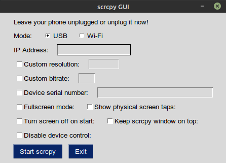

# scrcpy-gui

A tool allowing you to use scrcpy from a comfy GUI, without having to memorize any command-line parameters and to connect easily through Wi-Fi instead of USB!

##  Requirements

- A system running Windows or Linux (untested on macOS, but it should work there)

## If you're running on Linux/macOS and/or you're running from the .py file, you also need:

- An installation of Python 3
- scrcpy added to PATH (on Linux this can be done by installing scrcpy from your distro's repositories such as the AUR or Snap's repositories.)
- PySimpleGUI installed (`python3 -m pip install PySimpleGUI` or `python -m pip install PySimpleGUI`)

## Using

- If you're using Windows, you can just go to the [releases](https://github.com/hammy3502/scrcpy-gui/releases) page, and download the latest release of the exe file.
- If you're using the raw python file, you should be able to simply run the python file with a command such as: `python3 main.py` or `python main.py` (depending on if your default Python installation is Python 3 or not)
